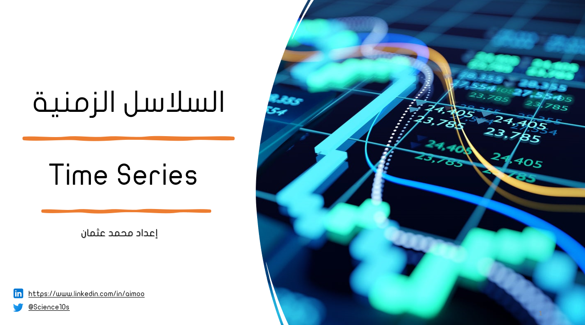

# Time Series Explaination in Arabic | شرح السلاسل الزمنية باللغة العربية

  

| Sr. No | Chapter                                                               |Status|
|:------:|----------------------------------------------------------------------------|:--:|
| 01.     | [نظرة عامة على السلاسل الزمنية](https://github.com/AI-MOO/Time_Series_Arabic_Explaination/blob/master/Slides/Chapter_01.pdf)|✅|
| 02.     | [التعامل مع السلاسل الزمنية باستخدام بايثون](https://github.com/AI-MOO/Time_Series_Arabic_Explaination/blob/master/Slides/Chapter_02.pdf)|✅| 
| 03.     | [التشويش الأبيض و السير العشوائي](https://github.com/AI-MOO/Time_Series_Arabic_Explaination/blob/master/Slides/Chapter_03.pdf)|✅|
| 04.     | [تحليل بيانات السلاسل الزمنية]()|✅|
| 05.     | [الارتباط التلقائي والارتباط التلقائي الجزئي]()||
| 06.     | [الأتمتة واختبارات الثبات]()||

